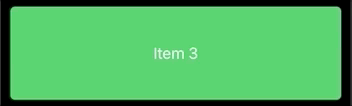

# Swipe Cell SwiftUI


Swipe Cell SwiftUI is a simple swipe-to-reveal menu view written in Swift. It supports iOS / iPadOs 13 or later. The purpose is to replace the default SwiftUI List .onDelete(perform: ...) modifier since its functionality is limited to deletion only and only works on List rows. Moreover, rows in an iOS 14 LazyVStack do not support swipe to reveal out of the box.
 Swipe Cell SwiftUI allows adding multiple menu buttons on the left and right side and also features a swipe out functionality (e.g. swipe to delete).
 

## Example project

This repo only contains the Swift package, no example XCode project. Please download the example project [here](https://github.com/DominikButz/SwipeCellSUI_Example.git).
Simply add the swift package through the Swift Package mMnager (see below - Installation). 

## Features

* Add multiple leading and/or trailing menu buttons 
* Fully customize each button view
* Add swipe out behavior to one button on each side
* Add a haptic feedback to indicate that the swipe out will be triggered 
* from version 2.0: auto closes an open cell if the user swipes another cell 
* from version 2.1: make an open cell close on tap on another cell (example below)


	Check out the example for details. 
	
	
## Installation


Installation through the Swift Package Manager (SPM) is recommended. 

SPM:
Select your project (not the target) and then select the Swift Packages tab. Click + and type SwipeCellSUI should find the package on github. Otherwise copy and paste the whole URL of this repo.


Check out the version history below for the current version.


Make sure to import SwipeCellSUI in every file where you use SwipeCellSUI. 

```Swift
    import SwipeCellSUI
```

## Usage

Check out the following example. This repo only contains the Swift package, no example code. Please download the example project [here](https://github.com/DominikButz/SwipeCellSUI_Example.git).

 


 


### Code example: Attach swipeCellSUI to the a row view

```Swift

struct RowView: View {
    var availableWidth: CGFloat
    var item: String
    @State private var isPinned: Bool = false
    var deletionCallback: (String)->()
    @Binding var currentUserInteractionCellID: String?
    
    var body: some View {
        Text(item).frame(width: availableWidth, height:100)
        .background(RoundedRectangle(cornerRadius: 5).foregroundColor(.green))
        .swipeCell(id: self.item, cellWidth: availableWidth, leadingSideGroup: leftGroup(), trailingSideGroup: rightGroup(), currentDragCellID:currentDragCellID)  
        .onTapGesture {
            // this will make another cell close, in case its side panel is open:  
            self.currentUserInteractionCellID = item
            // implement other functionality associated to tapping the row if required.
        }
        
        // you can customize settings by adding the settings parameter at the end
     
    }
    
    func leftGroup()->[SwipeCellActionItem] {
        return [ SwipeCellActionItem(buttonView: {
            
            self.pinView(swipeOut: false)
            
        }, swipeOutButtonView: {
            self.pinView(swipeOut: true)
        }, buttonWidth: 80, backgroundColor: .yellow, swipeOutAction: true, swipeOutHapticFeedbackType: .success, swipeOutIsDestructive: false)
        {
            print("pin action!")
            self.isPinned.toggle()
        }]
    }
    
    func pinView(swipeOut: Bool)->AnyView {

            Group {
                Spacer()
                VStack(spacing: 2) {
                    Image(systemName: self.isPinned ? "pin.slash": "pin").font(.system(size: 24)).foregroundColor(.white)
                    Text(self.isPinned ? "Unpin": "Pin").fixedSize().font(.system(size: 14)).foregroundColor(.white)
                }.frame(maxHeight: 80).padding(.horizontal, swipeOut ? 20 : 5)
                if swipeOut == false {
                    Spacer()
                } 
            }.animation(.default).castToAnyView()

    }

    func rightGroup()->[SwipeCellActionItem] {

        let items =  [
            SwipeCellActionItem(buttonView: {
    
                    VStack(spacing: 2)  {
                    Image(systemName: "person.crop.circle.badge.plus").font(.system(size: 22)).foregroundColor(.white)
                        Text("Share").fixedSize().font(.system(size: 12)).foregroundColor(.white)
                    }.frame(maxHeight: 80).castToAnyView()

            }, backgroundColor: .blue)
            {
                print("share action!")
            },
            SwipeCellActionItem(buttonView: {
                    VStack(spacing: 2)  {
                    Image(systemName: "folder.fill").font(.system(size: 22)).foregroundColor(.white)
                        Text("Move").fixedSize().font(.system(size: 12)).foregroundColor(.white)
                    }.frame(maxHeight: 80).castToAnyView()
          
            }, backgroundColor: .purple, actionCallback: {
                print("folder action")
            }),
            
            SwipeCellActionItem(buttonView: {
                self.trashView(swipeOut: false)
            }, swipeOutButtonView: {
                self.trashView(swipeOut: true)
            }, backgroundColor: .red, swipeOutAction: true, swipeOutHapticFeedbackType: .warning, swipeOutIsDestructive: true) {
                print("delete action")
               self.deletionCallback(item)
            }
          ]
        
        return items
    }
    
    func trashView(swipeOut: Bool)->AnyView {
            VStack(spacing: 3)  {
                Image(systemName: "trash").font(.system(size: swipeOut ? 28 : 22)).foregroundColor(.white)
                Text("Delete").fixedSize().font(.system(size: swipeOut ? 16 : 12)).foregroundColor(.white)
            }.frame(maxHeight: 80).animation(.default).castToAnyView()
        
    }
}

```

## Change log

#### [Version 2.1.0](https://github.com/DominikButz/SwipeCellSUI/releases/tag/2.1.0)
- changed parameter name currentDragCellID to currentUserInteractionCellID and its type to Binding<String?>
- set the currentUserInteractionCellID binding to the current id of your row or cell (e.g. onTap) if you want another open cell to close on tapping. For this to work, it is required to override the id parameter of the swipe cell modifier!

#### [Version 2.0.0](https://github.com/DominikButz/SwipeCellSUI/releases/tag/2.0.0)
Breaking changes: 
- now only supporting iOS 14 or newer. 
- you need to set a currentDragCellID optional UUID binding now (either originating from your view model as published var or in the parent view itself as State variable). This property will ascertain that if there are several swipe cells (as is typically the case in a list) and the user swipes a cell, another cell whose side menu is currently open, will automatically close (similar behavior as in the Apple iOS Notes app)

#### [Version 1.0.3](https://github.com/DominikButz/SwipeCellSUI/releases/tag/1.0.3)
Swipe Cell menu opening less easily now. 

#### [Version 1.0.2](https://github.com/DominikButz/SwipeCellSUI/releases/tag/1.0.2)
Settings properties can now be changed as expected.

#### [Version 1.0.1](https://github.com/DominikButz/SwipeCellSUI/releases/tag/1.0.1)
Initial public release. 


## Author

dominikbutz@gmail.com

## License

SwipeCellSUI is available under the MIT license. See the LICENSE file for more info.
